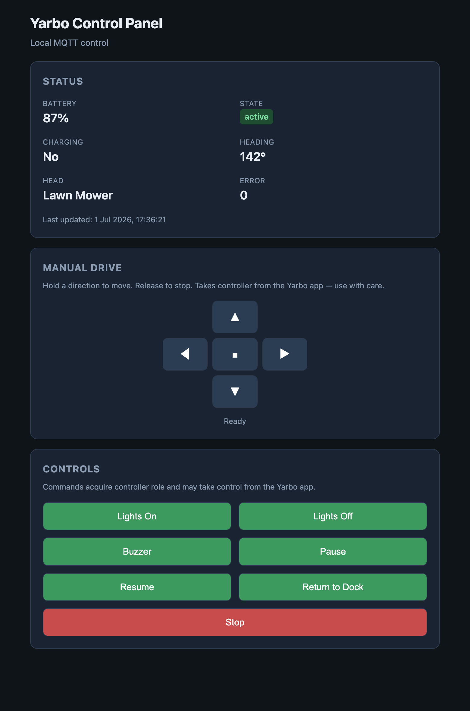
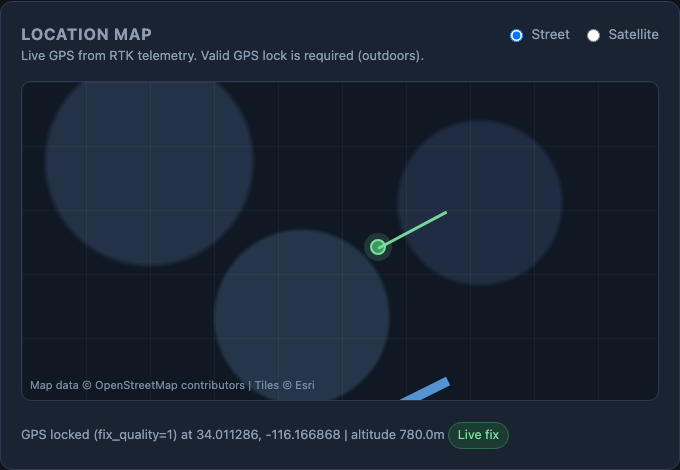
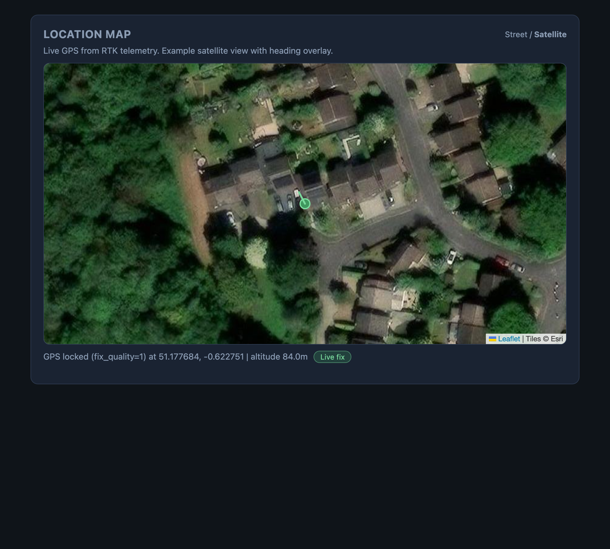
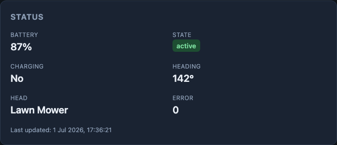
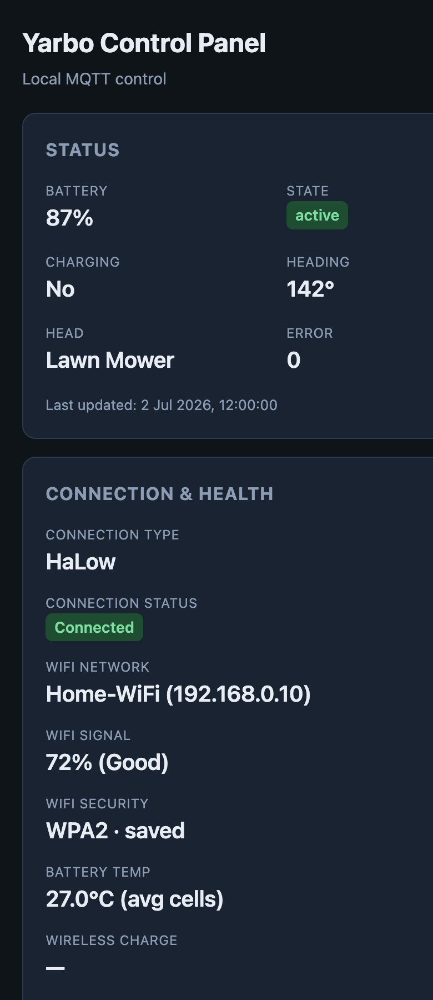

# Yarbo PHP Control Panel

A lightweight **web control panel** for [Yarbo](https://www.yarbo.com/) robot mowers and snow blowers. Open it in any browser on your home network to view live status, drive manually, run plans, and manage your robot.

**Local-first by design:** all controls (drive, pause, lights, plan start/delete, waypoints, head controls) use **local MQTT** on your LAN — the same path as the community Home Assistant integration. **No Yarbo cloud account is required** for day-to-day control.

**Optional cloud reads:** if local MQTT does not return saved map or plan data on your firmware, you can enable an optional cloud fallback in the web **Settings** page (Yarbo account + Python `yarbo-data-sdk`) to load mowing areas and work plans via the official [Yarbo Data SDK](https://github.com/YarboInc/YarboDataSDK). Cloud is read-only for map/plans; commands always stay on local MQTT.

This project was originally built to run on a **Raspberry Pi** (alongside Homebridge) as an always-on panel you can open from any phone, tablet, or computer on your LAN. It also runs fine on a Mac, Linux PC, NAS, or any machine with PHP — useful for development and testing.

The local MQTT protocol is based on community reverse-engineering documented in [home-assistant-yarbo](https://github.com/markus-lassfolk/home-assistant-yarbo) and [python-yarbo](https://github.com/markus-lassfolk/python-yarbo). Optional cloud reads follow patterns from the official Yarbo Data SDK.

> **Disclaimer — read before use**
>
> This is **unofficial** software. It is **not** affiliated with, endorsed by, or supported by Yarbo. By using this project you agree that:
>
> - You use it **entirely at your own risk**.
> - The author accepts **no liability** for any damage, injury, data loss, property damage, robot malfunction, or any other harm arising from its use.
> - There is **no guarantee** that it will work with your robot, firmware version, or network setup.
> - Commands sent via this panel (including manual drive) can move or stop your machine and may conflict with the official Yarbo app.
> - The MQTT protocol is reverse-engineered and **may change** without notice in future Yarbo firmware updates.
>
> If you are not comfortable with these risks, do not use this software.

---

## Screenshots

Sample telemetry and map data shown for illustration (fictional coordinates and network details).

<p align="center">
  
</p>

<p align="center">
  <em>Status, manual drive, plans, and controls — runs in any modern browser on your LAN.</em>
</p>

<p align="center">
  <br>
  <sub>Location Map mock-up (example data)</sub>
</p>

<p align="center">
  <br>
  <sub>Location Map satellite example (sample GPS fix)</sub>
</p>

<table>
  <tr>
    <td align="center" width="50%">
      <br>
      <sub>Live status from MQTT</sub>
    </td>
    <td align="center" width="50%">
      <br>
      <sub>Mobile-friendly layout</sub>
    </td>
  </tr>
</table>

---

## What it does

Open the panel in a browser and you can:

- **View live status** — battery, working state, charging, heading, attached head type, error codes (polled every 5 seconds)
- **View live GPS on a map** — Leaflet map with Street/Satellite layers, robot position, heading line, and GPS lock status
- **View connection & health diagnostics** — network type/status (HaLow/4G/WiFi when available), **WiFi network name, signal strength, and security** (via `get_connect_wifi_name`), battery temperature, wireless charge telemetry, RTK status, and link diagnostics
- **Probe saved mowing areas** — loads map geometry via local MQTT (`read_gps_ref`, `get_map`, …) with optional Yarbo cloud fallback when local data is empty
- **Control the robot** — lights, buzzer, pause, resume, return to dock, graceful stop (dual payload compatibility with official SDK command shapes)
- **Run work plans** — load saved plans (local or cloud), start at a chosen percentage, delete plans
- **Head-specific controls** — mower blade height/speed or snow chute angle when the attached head is detected
- **Navigate to waypoints** — send the robot to a stored waypoint by index
- **Manual drive** — hold-to-drive D-pad (forward, back, left, right) via MQTT `cmd_vel`
- **Camera streams** — *not currently functional for most users* (see [Camera support](#camera-support-not-currently-working) below)

Commands acquire the MQTT **controller role** first (`get_controller`), which may take control away from the official Yarbo mobile app while you are using the panel.

---

## How it works

```
Browser  →  PHP web server  →  Local MQTT (port 1883)  →  Yarbo robot
           (this project)         on your LAN              (controls + live status)

Optional (map/plan reads only):
Browser  →  PHP  →  cloud_bridge.py  →  Yarbo cloud  →  robot data
                     (yarbo-data-sdk)     (Settings)
```

| Path | Used for | Account needed? |
|------|----------|-----------------|
| **Local MQTT** | Live status, GPS, drive, controls, plans start/delete, waypoints | No — robot IP + serial only |
| **Cloud (optional)** | Reading saved maps and work plans when local MQTT returns nothing | Yes — Yarbo app account in Settings |

1. The browser loads a simple HTML/JS UI from the PHP built-in web server (or systemd on a Pi).
2. API endpoints connect to the Yarbo MQTT broker on your LAN for telemetry and commands.
3. Payloads are zlib-compressed JSON, matching the format used by the Yarbo app and Home Assistant integration.
4. Telemetry is requested with `get_device_msg`; WiFi details use `get_connect_wifi_name`.
5. Map/plan loads try local MQTT first (`read_gps_ref`, `get_map`, `read_all_plan`). If enabled, **Settings → cloud fallback** can fetch the same data via the official SDK.

GPS map fields (`latitude`, `longitude`, `altitude`, `fix_quality`, `gps_valid`) are parsed from `rtk_base_data.rover.gngga` when the robot reports a valid GNSS/RTK fix.

You need your Yarbo's **IP address** (MQTT broker host) and **serial number** (printed on the device / found in the Yarbo app). Cloud credentials are optional and only used for map/plan reads.

---

## Requirements

| Requirement | Notes |
|-------------|-------|
| **PHP 8.1+** | CLI and built-in web server |
| **PHP zlib extension** | Usually included by default |
| **Composer** | To install the MQTT client dependency |
| **Same network as Yarbo** | The host must reach the robot on port **1883** |
| **Python 3 + yarbo-data-sdk** | Optional — only for cloud map/plan reads (`./scripts/install.sh` can install this) |
| **ffmpeg** | Only relevant if experimenting with cameras (not working for most users — see below) |

---

## Quick start

### Raspberry Pi / Linux (recommended — 2 commands)

On a fresh **Raspberry Pi OS** or Debian/Ubuntu host:

```bash
git clone https://github.com/martyndix/yarbo-control-panel.git ~/yarbo
cd ~/yarbo && sudo ./scripts/install.sh --deps
```

This one command:

1. Installs PHP, Composer, Git, and Python (apt)
2. Runs `composer install` and creates `config.php`
3. Installs and **enables a systemd service** so the panel starts on boot
4. Starts the panel immediately

Then open the URL printed at the end (e.g. `http://192.168.0.50:8080`), click **Settings**, and enter your **Yarbo broker IP** and **serial number**. No need to edit `config.php` by hand.

If PHP and Composer are already installed:

```bash
git clone https://github.com/martyndix/yarbo-control-panel.git ~/yarbo
cd ~/yarbo && sudo ./scripts/install.sh
```

(`--deps` is only needed the first time on a bare system.)

### macOS / manual / development

```bash
git clone https://github.com/martyndix/yarbo-control-panel.git
cd yarbo-control-panel
./scripts/install.sh
php -S 0.0.0.0:8080 -t public
```

Open **http://localhost:8080**, click **Settings**, and enter broker IP and serial. macOS has no systemd — keep the terminal open, or run on a Pi for always-on use.

### After install

| Step | What to do |
|------|------------|
| **Connect robot** | Pi/host must be on the same network as Yarbo; port **1883** reachable |
| **Configure** | Web **Settings** → broker IP + serial (writes `config.php`) |
| **Optional cloud** | Settings → enable cloud fallback for map/plan reads |
| **Check status** | `sudo systemctl status yarbo-panel` (Linux with systemd) |

The install script runs `composer install`, creates `config.php` if missing, creates the `data/` directory, and optionally installs the Python `yarbo-data-sdk` package for cloud map/plan reads.

Legacy manual install (if you prefer):

```bash
composer install
cp config.example.php config.php
php -S 0.0.0.0:8080 -t public
# Then use the web Settings page — editing config.php is optional
```

---

## Installation by platform

### Raspberry Pi (recommended — always-on server)

Ideal for a Pi running 24/7 (e.g. next to Homebridge). Tested on Raspberry Pi OS with PHP 8.4.

**Full install (copy-paste):**

```bash
git clone https://github.com/martyndix/yarbo-control-panel.git ~/yarbo
cd ~/yarbo && sudo ./scripts/install.sh --deps
```

Open the URL shown in the terminal, then **Settings** → enter Yarbo IP and serial.

**What `--deps` installs:** `php`, `composer`, `git`, `python3`, and related packages via apt.

**What the installer configures automatically:**

- PHP dependencies (`composer install`)
- `config.php` from the example template
- `data/` directory for waypoints and optional cloud credentials
- **systemd service** `yarbo-panel` — enabled on boot, restarts on failure

**Useful commands after install:**

```bash
sudo systemctl status yarbo-panel     # is it running?
sudo systemctl restart yarbo-panel    # after manual config.php edits (Settings usually avoids this)
sudo journalctl -u yarbo-panel -f     # live logs
```

A printable quick-reference for Pi administration is in [`docs/yarbo-pi-commands.html`](docs/yarbo-pi-commands.html).

<details>
<summary>Manual Pi steps (if you prefer not to use the installer)</summary>

**1. Install PHP and Composer**

```bash
sudo apt update
sudo apt install -y php php-cli php-mbstring php-xml php-zlib composer unzip git
```

**2. Clone and run installer (without apt deps)**

```bash
git clone https://github.com/martyndix/yarbo-control-panel.git ~/yarbo
cd ~/yarbo && sudo ./scripts/install.sh
```

**3. Configure in the browser**

Open `http://<pi-ip>:8080` → **Settings** → broker IP and serial.

</details>

---

### macOS

```bash
brew install php composer
git clone https://github.com/martyndix/yarbo-control-panel.git
cd yarbo-control-panel
./scripts/install.sh
php -S 0.0.0.0:8080 -t public
```

Open **http://localhost:8080** → **Settings** → broker IP and serial.

macOS does not use systemd. For always-on hosting, use a Raspberry Pi with `sudo ./scripts/install.sh --deps`.

---

### Linux (Debian/Ubuntu and similar)

Same as Raspberry Pi:

```bash
git clone https://github.com/martyndix/yarbo-control-panel.git ~/yarbo
cd ~/yarbo && sudo ./scripts/install.sh --deps
```

Configure in the browser via **Settings** (no need to edit `config.php`).

**Fedora/RHEL** (install packages manually, then run the installer):

```bash
sudo dnf install php php-cli composer git python3 python3-pip
git clone https://github.com/martyndix/yarbo-control-panel.git ~/yarbo
cd ~/yarbo && sudo ./scripts/install.sh
```

---

### Windows

Not the primary target platform, but it works if you have PHP and Composer installed:

1. Install [PHP for Windows](https://windows.php.net/download/) (8.1+) and [Composer](https://getcomposer.org/download/)
2. Clone this repo in PowerShell or Git Bash
3. Run `./scripts/install.sh` (or `composer install` and copy `config.example.php` to `config.php`)
4. Start the server: `php -S 0.0.0.0:8080 -t public`
5. Open **http://localhost:8080** → **Settings** → broker IP and serial

For an always-on setup, a Raspberry Pi with `sudo ./scripts/install.sh --deps` is simpler.

---

### Docker

Docker is not included yet. The panel is a single PHP process with no database — a Pi or small Linux host with systemd is the intended deployment.

---

## Configuration

The installer creates `config.php` from `config.example.php`. **`config.php` is git-ignored** — never commit your serial number or network details.

**Recommended:** click **Settings** in the panel header to set **broker IP** and **serial number**. This writes `config.php` for you — no SSH or text editor required.

| Setting | Description |
|---------|-------------|
| `broker_host` | Yarbo robot IP address (MQTT broker) — set via **Settings** |
| `broker_port` | Usually `1883` |
| `serial` | Robot serial number — set via **Settings** |
| `cameras_enabled` | `false` — **keep disabled**; local camera streams do not work yet (see below) |
| `camera_host` | Override RTSP host; `null` uses `broker_host` (experimental only) |
| `ffmpeg_path` | Path to ffmpeg binary (only needed if experimenting with cameras) |

Optional cloud map/plan credentials are stored in `data/cloud-config.json` (also via **Settings**), not in `config.php`.

---

## GPS map support

The panel now includes a **Location Map** card (Leaflet) showing live robot GPS and heading.

- Base layers: **OpenStreetMap (Street)** and **Esri World Imagery (Satellite)**
- Marker updates from `/api/status.php` every 5 seconds
- Map shows a clear message when no valid fix is available

Notes:

- GPS depends on the robot reporting valid `gngga` telemetry.
- Indoors / under cover / without RTK lock, `gps_valid` may be `false`.
- If coordinates are missing, move the robot outdoors and wait for lock.

---

## Mowing map extraction status

The panel loads saved areas via **local MQTT** (`read_gps_ref` + `get_map`) and converts local coordinates to GPS when a reference origin is available. If local MQTT returns no drawable geometry, enable **cloud fallback reads** in the web **Settings** page (optional Yarbo account + `yarbo-data-sdk`).

On some firmware, map commands return no `data_feedback` response until a map exists in the Yarbo app workflow.

### How to re-test

After creating/saving a map in the official Yarbo workflow, run:

```bash
php scripts/discover_map.php
```

Discovery output is written to `debug/map-dumps/map_discovery_YYYYMMDD_HHMMSS.json` for inspection.

If future runs start returning structured payloads, overlays appear automatically on the Location Map card. Cloud reads use the official [Yarbo Data SDK](https://github.com/YarboInc/YarboDataSDK) behind the scenes — you configure it from the web UI, not from the command line.

---

## Optional cloud reads (map & plans)

Local MQTT remains the default for **all controls** (drive, pause, plans start/delete, etc.). Cloud is only used for **reading** map/plan data when you enable it in **Settings**:

1. Run `./scripts/install.sh` (installs `yarbo-data-sdk` when Python/pip are available)
2. Open **Settings** in the panel
3. Enable cloud fallback, enter Yarbo account email/password, choose data source (`auto` / `local` / `cloud`)
4. Use **Test cloud connection** to verify the bridge

Credentials are stored in `data/cloud-config.json` (gitignored), not in `config.php`.

---

### Community testing for saved areas (beta)

The UI now includes **Load saved mowing areas (beta)** in the Location Map card.

What it does:

- Calls `/api/map.php`
- Probes map-related MQTT commands
- Tries to extract lat/lon geometry and draw overlays on the map

Expected outcomes:

- **Works** on firmware/robots that return drawable geometry
- **Empty** if no saved map exists yet
- **Structured but not drawable** when payload format differs (helps reverse-engineering)

If you are testing with a stored map and it does not render, please share:

- `debug/map-dumps/map_discovery_*.json` output from `php scripts/discover_map.php`
- Your firmware version
- Whether the robot has at least one saved map/area in the official app

---

## Connection & health diagnostics

The dashboard now includes a **Connection & Health** card with additional operational metrics when your firmware reports them.

Metrics shown:

- `connection_type` and `connection_status` (derived from `net_type`, `halow_status`, `net_module_status`)
- WiFi network name, signal strength (%), security, and IP (from MQTT `get_connect_wifi_name` when the robot responds)
- battery temperature (`battery_diagnostics.temperature_c`), with `(avg cells)` shown when derived from `temperature1`..`temperature6`
- wireless charging voltage/current
- RTK status and fix quality
- RTCM age and route priority

Notes:

- Some robots/firmware variants do not expose all fields all the time.
- Missing values are shown as `—` by design.
- Connection labels are best-effort interpretations of Yarbo telemetry keys and may vary by firmware.

---

## Work plans & waypoints

The panel can manage saved work plans and waypoint navigation using the same MQTT commands as the [Home Assistant Yarbo integration services](https://github.com/markus-lassfolk/home-assistant-yarbo/blob/main/docs/services.md).

### Work plans

- **Load plans** — `read_all_plan` via `GET /api/plans.php`
- **Start plan** — `start_plan` with `planId` and `percent` (0–100)
- **Delete plan** — `del_plan` with confirmation

UI: **Work Plans** card → adjust start percentage → **Load plans** → **Start** or **Delete** on a plan.

Note: some robots/firmware only respond to `read_all_plan` when the robot is active or while a plan is running. If loading returns empty, try again after waking the robot or starting a job from the Yarbo app.

### Waypoints

- **Go to waypoint** — `start_way_point` with `index` (0–9999)
- **Named bookmarks** — save friendly labels mapped to robot indices in `data/waypoints.json` (panel-side; not on the robot)

UI: **Waypoints** card → save **Name** + **Robot index** → **Go** on a saved entry. Use the **⋯** menu to edit or delete.

The robot does not expose a documented MQTT command to list stored waypoint names (probed commands such as `read_all_way_point` returned no response on test hardware). Named bookmarks live on the panel server so you do not have to remember indices.

---

## Controls

| UI control | MQTT command | Notes |
|------------|--------------|-------|
| Lights On / Off | `light_ctrl` | All 7 LED channels |
| Buzzer | `cmd_buzzer` | |
| Pause | `planning_paused` | |
| Resume | `resume` | |
| Return to Dock | `cmd_recharge` | |
| Stop | `dstop` | Graceful stop |
| Start work plan | `start_plan` | `planId`, `percent` |
| Delete work plan | `del_plan` | Destructive — requires confirm in UI |
| Go to waypoint | `start_way_point` | `index` 0–9999 |
| Manual drive D-pad | `set_working_state` + `cmd_vel` | Hold to move; enters manual mode |

---

## Camera support (not currently working)

**Local camera streams do not work in practice on current Yarbo hardware/firmware.** This is not a bug in this project — Yarbo has not opened up local camera access to third-party tools.

What we know from testing and community documentation:

- The official Yarbo app uses **cloud-based video** (Smart Vision), not LAN RTSP streams exposed to your network.
- The robot has internal RTSP cameras, but they sit on a private internal network and are **not reachable** from a normal home LAN connection to the robot's Wi‑Fi IP.
- MQTT commands such as `camera_toggle` and `smart_vision_control` can be sent, but they do **not** make local RTSP streams available to this panel.
- Ports 19201–19204 are documented in community reverse-engineering, but in real-world use they are not open on the broker IP for most owners.

For these reasons, **leave `cameras_enabled` set to `false`** in `config.php`. The camera-related code remains in the repository for future use if Yarbo ever enables local stream access, but it should be treated as **experimental and non-functional** today.

| Camera | Documented port | Documented URL |
|--------|-----------------|----------------|
| Front | 19201 | `rtsp://HOST:19201/live/chn0` |
| Left | 19202 | `rtsp://HOST:19202/live/chn0` |
| Right | 19203 | `rtsp://HOST:19203/live/chn0` |
| Rear | 19204 | `rtsp://HOST:19204/live/chn0` |

Do not install ffmpeg or spend time on camera tunnels unless you have independently verified RTSP access on your specific unit.

---

## Security

- The Yarbo MQTT broker (port **1883**) has **no authentication**. Anyone on your Wi‑Fi who knows the robot IP can read telemetry and send commands.
- Keep this control panel on your **LAN only** — do not port-forward port 8080 or 1883 to the internet.
- Manual drive can move the robot — use only on flat, clear ground and away from people.

---

## Troubleshooting

| Problem | What to check |
|---------|---------------|
| Status shows an error | `nc -zv <yarbo-ip> 1883` from the host running the panel |
| Commands do nothing | Yarbo app may hold controller; try again — panel calls `get_controller` first |
| Page won't load | Is PHP running? `curl http://127.0.0.1:8080/api/status.php` |
| Pi service won't start | `sudo journalctl -u yarbo-panel -n 50` — check PHP path in the service file |
| Wrong subnet | Pi and Yarbo must be able to route to each other (e.g. `192.168.9.x` → `192.168.1.x`) |

**API smoke test:**

```bash
curl -s http://localhost:8080/api/status.php
curl -X POST -d "action=lights_on" http://localhost:8080/api/command.php
```

---

## Project structure

```
yarbo-control-panel/
├── CHANGELOG.md          # Release notes (updated each publish)
├── config.example.php    # Copy to config.php (not in git)
├── public/               # Web root (index.php, assets, api/)
├── src/                  # MQTT codec, client, telemetry
├── deploy/               # systemd service template for Pi/Linux
├── docs/                 # Pi quick-reference (PDF + HTML)
└── scripts/              # Helper scripts (camera tunnel)
```

---

## Changelog

Release notes are tracked in [`CHANGELOG.md`](CHANGELOG.md).  
For each published update, add an entry with date, version tag (or `Unreleased`), and key changes.

---

## Credits

- Protocol and command reference: [home-assistant-yarbo](https://github.com/markus-lassfolk/home-assistant-yarbo) / [python-yarbo](https://github.com/markus-lassfolk/python-yarbo)
- MQTT client: [php-mqtt/client](https://github.com/php-mqtt/client)

---

## License and disclaimer

This is unofficial community software — **not affiliated with Yarbo**.

See the [disclaimer at the top of this README](#yarbo-php-control-panel) for the full terms. In short: **no warranty, no guarantee of fitness for any purpose, and no liability** to the author for any consequences of using this software. You assume all responsibility for how you use it and for the safety of people, property, and equipment around your robot.
