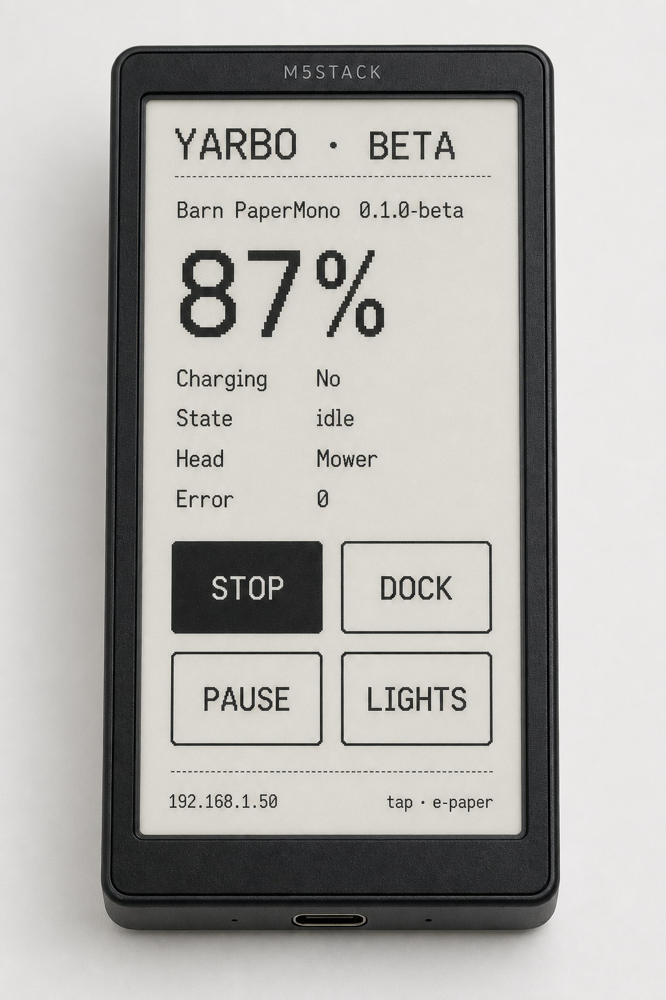
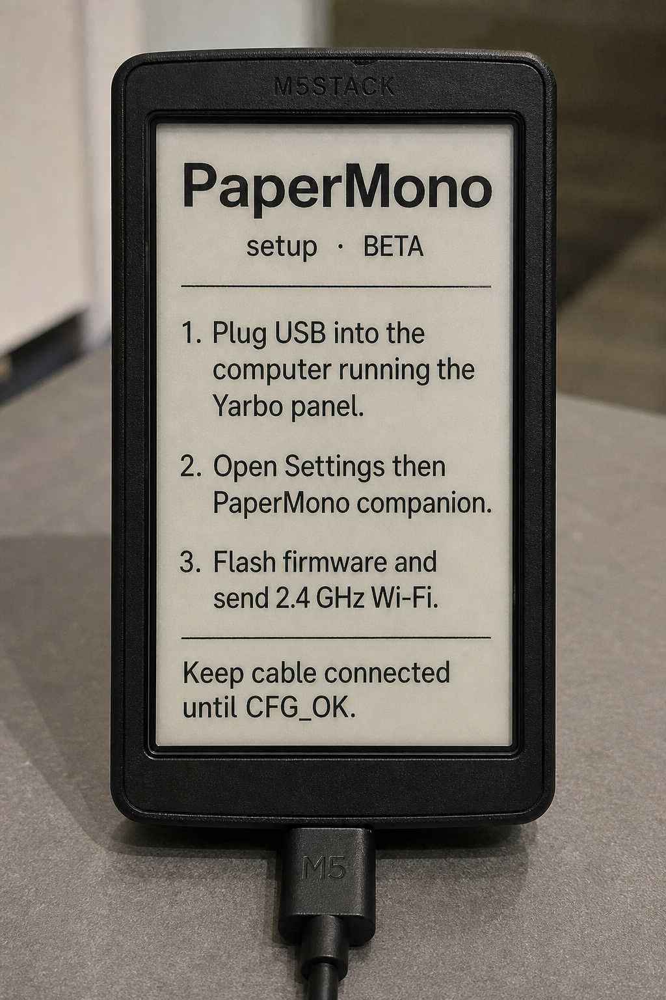

# PaperMono companion (beta)

This firmware and Settings flash path are built for **M5Stack PaperMono, SKU C153** (the full unit with NFC and LoRa). That is the board whose datasheet you pasted: ESP32-S3R8, 3.97″ SSD1677 480×800 e-paper, FT6336G touch.

| | |
| --- | --- |
| **Model** | M5Stack PaperMono |
| **SKU** | **C153** |
| **Docs** | [docs.m5stack.com/en/core/PaperMono](https://docs.m5stack.com/en/core/PaperMono) |
| **Shop** | [M5PaperMono with LoRa & NFC (3.97″)](https://shop.m5stack.com/products/m5papermono-with-lora-nfc-800x480-3-97-eink-display) |
| **Not this SKU** | [PaperMono-Lite (C153-Lite)](https://docs.m5stack.com/en/core/PaperMono-Lite) — same screen/SoC, no NFC/LoRa. This companion does not use NFC or LoRa, so Lite may run the same binary, but it is not the model we targeted. |

Hardware we compile for:

- ESP32-S3R8, 16MB flash, 8MB octal PSRAM, 2.4 GHz Wi-Fi
- 3.97″ SSD1677 e-paper, **480×800** portrait (shop listings sometimes write 800×480), 4-level grayscale
- FT6336G touch, built-in frontlight
- Two user buttons + power (ON / OFF / RESET / BOOT)
- 1150mAh battery, USB-C
- Onboard NFC (ST25R3916) and LoRa (SX1262) are **present on C153 and unused** by this firmware

It has **no browser**. This panel flashes native firmware over USB from **Settings**, then the tablet talks HTTP JSON to the panel. The panel stays the MQTT brain.

This is **beta**. Treat it as a companion, not a replacement for the web UI or the official app.

Home and first-boot mocks (not photos of a flashed unit):





## What it shows

- Battery, charging, working state, attached head, error code
- Large buttons: **Stop**, **Dock**, **Pause** / **Resume**, **Lights**
- If M5Unified maps them, the two hardware keys also send Stop and Dock

It does **not** include map, cameras, plans, or hold-to-drive. E-paper is too slow for those. NFC, LoRa, mic, IMU, and the SD slot are unused in this firmware.

## E-paper care (manufacturer)

The SSD1677 panel is easy to damage if driven badly. Firmware follows these rules:

- After about **10 partial (fast) refreshes**, run **one full-screen refresh** to clear ghosting.
- **Do not** stream uninterrupted partial refreshes (DC imbalance can permanently damage the panel).
- Skip a redraw when status has not changed.
- Use the panel’s built-in OTP waveforms (M5GFX `epd_quality` / `epd_fastest`). Do not load custom LUTs unless you know DC balance.
- Keep the device out of direct sun and strong UV; heat and UV can ruin the film.
- Status poll is 15 seconds, not a tight loop.

## Architecture

```
Desktop Settings  →  PHP /api/device.php  →  USB (esptool + serial CFG:)
PaperMono firmware → GET compact status + POST command (token)
                     → PHP → MQTT agent → robot
```

Paired devices are stored in `data/papermono-devices.json` (not committed). The firmware token is written over USB; it is not shown again in Settings after flash.

## First-time setup

On the **same machine that runs the panel**:

1. Install helpers:

   ```bash
   pip3 install platformio pyserial esptool
   pio run -d firmware/papermono
   ```

2. Plug the PaperMono in by USB. To enter download mode, hold the power button about 2 seconds until the red LED blinks, then release (M5Stack docs). First boot of our firmware shows a setup screen until config arrives.
3. Open the panel → **Settings → PaperMono companion**.
4. Refresh USB ports and select the PaperMono serial device.
5. Enter:
   - Wi-Fi SSID and password (**2.4 GHz only**)
   - Panel URL as the tablet will reach it (for example `http://192.168.1.50:8080`, not `localhost`)
   - A device name
6. Click **Flash firmware & send Wi-Fi**. Leave Settings open for one to two minutes.

**Send Wi-Fi only** reuses already-flashed firmware and pushes a new `CFG:` line over serial (SSID, password, panel URL, token).

## Runtime

The tablet polls `GET /api/device.php?action=compact` about every 15 seconds with header `X-PaperMono-Token`. Commands POST JSON `{ "action": "command", "command": "stop" }` (also `return_to_dock`, `pause`, `resume`, `lights_on`, `lights_off`).

Those commands use the same MQTT agent as the web Controls. Stop is immediate (no confirm). Firmware later can pull `GET /api/device.php?action=firmware` for OTA; that is not wired in 0.1.0-beta yet.

## Limits

- One MQTT controller at a time, same as the web panel.
- Status watch does not take the controller. Stop / Dock / Pause / Lights do, via the agent.
- Mild ghosting between full refreshes is normal.
- If flash fails, check the USB port, `pyserial` / `esptool`, and that `firmware/papermono/.pio/build/papermono/firmware.bin` exists.
