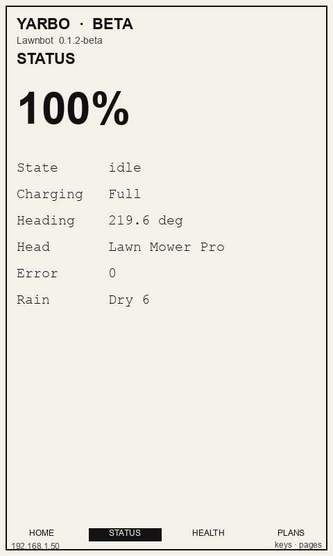
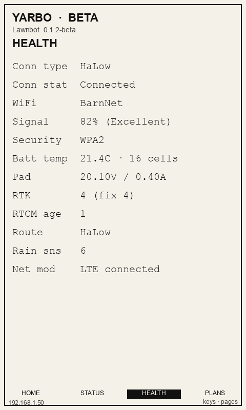
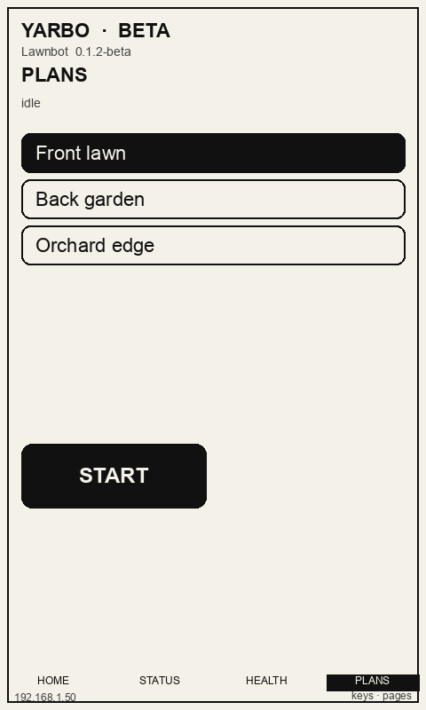

# PaperMono companion (beta)

This firmware and Settings flash path are built for **M5Stack PaperMono, SKU C153** (the full unit with NFC and LoRa). That is the board whose datasheet you pasted: ESP32-S3R8, 3.97″ SSD1677 480×800 e-paper, FT6336G touch. Paper Colour (Spectra 6, no touch) uses the same Settings page: pick **Paper Colour** so the panel flashes `firmware/papercolor/` instead. See `docs/papercolor.md`.

| | |
| --- | --- |
| **Model** | M5Stack PaperMono |
| **SKU** | **C153** |
| **Docs** | [docs.m5stack.com/en/core/PaperMono](https://docs.m5stack.com/en/core/PaperMono) |
| **Shop** | [M5PaperMono with LoRa & NFC (3.97″)](https://shop.m5stack.com/products/m5papermono-with-lora-nfc-800x480-3-97-eink-display) |
| **Not this SKU** | [PaperMono-Lite (C153-Lite)](https://docs.m5stack.com/en/core/PaperMono-Lite) — same screen/SoC, no NFC/LoRa. RADIO will use Wi-Fi fallback only on Lite. |

Hardware we compile for:

- ESP32-S3R8, 16MB flash, 8MB octal PSRAM, 2.4 GHz Wi-Fi
- 3.97″ SSD1677 e-paper, **480×800** portrait (shop listings sometimes write 800×480), 4-level grayscale
- FT6336G touch, built-in frontlight
- Two user buttons + power (ON / OFF / RESET / BOOT)
- 1150mAh battery, USB-C
- Onboard NFC (ST25R3916) and LoRa (SX1262). Firmware **0.1.9-beta** uses LoRa for RADIO (868 MHz, house sync word) with Wi-Fi fallback.

It has **no browser**. This panel flashes native firmware over USB from **Settings**, then the tablet talks HTTP JSON to the panel. The panel stays the MQTT brain.

This is **beta**. Treat it as a companion, not a replacement for the web UI or the official app.

Home and extra-page mocks (not photos of a flashed unit):









## What it shows

- **Home:** battery, charging, working state, attached head, error code, and large **Stop**, **Dock**, **Pause** / **Resume**, **Lights**
- Optional **header logo** (Settings → E-paper companions). Same image on Paper Colour. Prefer a transparent PNG. Needs firmware **0.1.9-beta**.
- **Status:** the same tiles as the web Status card (including heading and rain)
- **Health:** the same tiles as Connection & Health (Wi-Fi, pad, RTK, and so on)
- **Plans:** named work plans. Tap a row to select, tap **START** to run it from 0% (same MQTT start as the web panel)
- **Note:** Vestaboard live view picker. Tap **YARBO**, and **WALL** / **LYMOW** / **ALL** only when those modules are enabled. Hidden when Vestaboard is off.
- **Board:** live 3×15 preview of what the Vestaboard Note is showing. Hidden when Vestaboard is off.
- **Lymow:** Lymow battery, state, and charging. Hidden when the Lymow module is off.
- **Radio:** house messages (~180 characters) to **ALL** or a named peer. Tries LoRa first, then Wi-Fi via the panel.
- **Device:** this tablet’s battery, clock, and **OFF** (full power-off). Brightness, mute, and timers are Settings only.
- **Lock screen:** idle timer from Settings. Layout is logo, Vestaboard, or both. Tablet name is on the lock screen. Unlock is two opposite-corner taps (1 then 2). The red side button returns to lock. Incoming messages stay locked and badge + beep/flash if alerts are on.
- Hardware keys cycle enabled pages when unlocked. Stop / Dock are Home buttons only.

It does **not** include map, cameras, plan delete, or hold-to-drive. E-paper is too slow for those. NFC, mic, IMU, and the SD slot are unused in this firmware. Sleep timers, brightness, buzzer, and RGB alerts are set in **Settings → E-paper companions**, not on the tablet.

## E-paper care (manufacturer)

The SSD1677 panel is easy to damage if driven badly. Firmware follows these rules:

- After about **10 partial (fast) refreshes**, run **one full-screen refresh** to clear ghosting.
- **Do not** stream uninterrupted partial refreshes (DC imbalance can permanently damage the panel).
- Skip a redraw when status has not changed.
- Use the panel’s built-in OTP waveforms (M5GFX `epd_quality` / `epd_fastest`). Do not load custom LUTs unless you know DC balance.
- Keep the device out of direct sun and strong UV; heat and UV can ruin the film.
- Status poll is 15 seconds, not a tight loop.

## Architecture

```
Desktop Settings  →  PHP /api/device.php  →  USB (esptool + serial CFG:)
PaperMono firmware → GET compact status + POST command (token)
                     → PHP → MQTT agent → robot
```

Paired devices are stored in `data/papermono-devices.json` (not committed). The firmware token is written over USB; it is not shown again in Settings after flash.

## First-time setup

On the **same machine that runs the panel**:

1. Plug the PaperMono in by USB. To enter download mode, hold the power button about 2 seconds until the red LED blinks, then release (M5Stack docs). First boot of our firmware shows a setup screen until config arrives.
2. Open the panel → **Settings → E-paper companions** and leave **PaperMono** selected (not Paper Colour).
3. Click **Build firmware** and wait until the status says it is built (first time can take several minutes).
4. Refresh USB ports and select the PaperMono serial device. If the list fails because `pyserial` / `esptool` are missing, click **Install USB tools**.
5. Enter:
   - Wi-Fi SSID and password (**2.4 GHz only**)
   - Panel URL as the tablet will reach it (for example `http://192.168.1.50:8080`, not `localhost`)
   - A device name
   - Optional header logo (PNG/JPEG). Preview shows on the mocks; reflash so the glass updates.
6. Click **Flash firmware & send Wi-Fi**. Leave Settings open. Flash will build first if the binary is missing or stale.

**Send Wi-Fi only** reuses already-flashed firmware and pushes a new `CFG:` line over serial (SSID, password, panel URL, token).

## Runtime

The tablet polls `GET /api/device.php?action=compact` about every 15 seconds with header `X-PaperMono-Token`. Compact status includes `vestaboard_enabled`, `vestaboard_live`, `powerwall_enabled`, and `lymow_enabled`. The Plans page also calls `GET /api/device.php?action=plans` (cached on the Pi for about five minutes). Commands POST JSON `{ "action": "command", "command": "stop" }` (also `return_to_dock`, `pause`, `resume`, `lights_on`, `lights_off`, `start_plan` with `plan_id`, and `vestaboard_live` with `vestaboard_live` set to `yarbo`, `powerwall`, `lymow`, or `batteries`).

Stop / Dock / Pause / Lights / start plan use the same MQTT agent as the web Controls. Stop is immediate (no confirm). Starting a plan takes the controller, same as the web **Start** button. Changing the Vestaboard view does not take the robot controller. Firmware later can pull `GET /api/device.php?action=firmware` for OTA; that is not wired yet. The header logo is `GET /api/device.php?action=logo` when compact status includes `logo_hash`.

## Limits

- One MQTT controller at a time, same as the web panel.
- Status watch does not take the controller. Stop / Dock / Pause / Lights do, via the agent.
- Mild ghosting between full refreshes is normal.
- If flash fails, check the USB port, click **Install USB tools** if `pyserial` / `esptool` are missing, and click **Build firmware** if the binary is missing.
