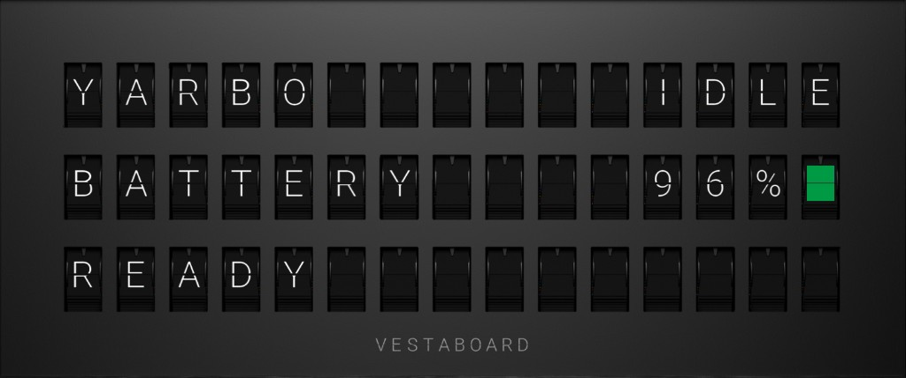

# Vestaboard Note (optional)

Show Yarbo status on a [Vestaboard Note](https://docs.vestaboard.com/) (3 rows × 15 columns). In Settings you choose **Local API** (LAN only) or **Cloud API** (Vestaboard’s [Read/Write API](https://docs.vestaboard.com/docs/read-write-api/introduction/)).

This is optional. Leave **Enable Vestaboard Note** off if you do not have a board.



## What it shows

Uppercase 15-character lines, for example:

```
YARBO    MOWING
BATTERY     85%
MOWER
```

```
YARBO  CHARGING
BATTERY     55%
ON DOCK
```

```
YARBO      IDLE
BATTERY    FULL
CHARGED
```

```
YARBO      IDLE
BATTERY    FULL
MOWER PRO  RAIN
```

```
YARBO      PAUSED
BATTERY     81%
■■■PLAN HOLD■■■
```

Paused centres **PLAN HOLD** and fills the empty flaps with yellow. Battery percent matches the Status tile (not rounded). A colour chip sits at the end of the battery line: green at 60% or more (and Full), yellow from 40%, orange from 20%, red below that. Rain uses a blue chip on the bottom-right **RAIN** tile when the rain sensor is at or above the Yarbo app **Rain Sensitivity** slider (20–1000; set in panel Settings, or 20 if left blank). The top line stays **IDLE** and the third line shows the attached head. In an error state the Note shows red chips on the ERROR and CODE lines. Sitting on the charger is **CHARGING** (or **IDLE** when Full), even if `on_going_recharging` is still set after arrival. A leftover docking flag is also ignored once the robot is sitting still at 95% or more. Sitting Full on the charger is **IDLE** when the sensor is dry, even if the robot is still app-awake after a cancelled plan. Full uses the same rule as the panel (on the pad and capacity ≥ 95%). Updates are sent only when that 3-line message changes, and not more than once every 15 seconds (Vestaboard’s hardware rate limit). The MQTT agent also pushes the Note, so it still updates if the browser is closed.

## Quiet hours

In **Settings → Vestaboard Note**, enable **Quiet hours** and set start/end times on **this host’s clock** (the Pi). Overnight windows wrap midnight (for example 22:00–07:00).

At the start of the window the panel writes your custom 3×15 message once (tap each flap for a letter or colour chip). After that it does not push Yarbo status, so the flaps stay still. When the window ends, live status resumes on the next tick.

This is separate from Quiet Hours in the Vestaboard **app**. The app setting can still drop **Cloud** writes; panel Quiet Hours also covers Local API and actually stops the watcher.

## Setup (either API)

1. Open the panel → **Settings → Vestaboard Note**.
2. Check **Enable Vestaboard Note**.
3. Choose **Local API** or **Cloud API** and enter that credential (below).
4. Use the 3×15 preview (live or samples).
5. **Test connection**, then **Save**. **Send now** writes the current layout immediately. A **Vestaboard Note** section also appears on the main dashboard with the same 3×15 layout (you can hide or reorder it under Appearance).
6. Restart the panel (or reboot the Pi) so `scripts/vestaboard_watch.php` is running beside the MQTT agent. After that, the Note updates with no browser open.

Credentials are stored in `data/vestaboard-config.json` (not committed). Local key and Cloud token are kept separately so you can switch modes without losing the unused one.

## Local API

Talks to the Note on your LAN (`http://{host}:7000/local-api/message`). The board never leaves the local network.

1. Request a one-time **enablement token** from Vestaboard’s [Local API request form](https://www.vestaboard.com/local-api). The Note must be paired and online. They email that token to the owner — it is **not** the API key. Official steps: [Authentication](https://docs.vestaboard.com/docs/local-api/authentication/).
2. On the same LAN (IPv4; `vestaboard.local` or the board’s IP), exchange the email token for the real key:

   ```bash
   curl -X POST \
     -H "X-Vestaboard-Local-Api-Enablement-Token: YOUR_EMAIL_TOKEN" \
     http://vestaboard.local:7000/local-api/enablement
   ```

   Copy `apiKey` from the JSON response. If `vestaboard.local` fails, use the Note’s IPv4 address. IPv6 is unreliable per Vestaboard.
3. In Settings, choose **Local API**, enter the host and that **apiKey**.

## Cloud API

Uses Vestaboard’s cloud (`https://cloud.vestaboard.com/`) with header `X-Vestaboard-Token`. The Note can be on another network as long as it is online in the Vestaboard app.

1. In the Vestaboard app go to **Settings → Advanced**, or open the [web app](https://web.vestaboard.com/) API tab. Official steps: [Authentication](https://docs.vestaboard.com/docs/read-write-api/authentication/).
2. **Create New Token**. Enable **Read** and **Write** (Test connection uses Read; Send uses Write). Name it and create it.
3. Copy the token immediately — Vestaboard will not show it again.
4. In Settings, choose **Cloud API** and paste that token.

The Cloud API does not accept a blank board. Quiet hours in the Vestaboard **app** can still drop Cloud writes. Use **Settings → Quiet hours** on this panel to stop Yarbo status updates overnight (Local and Cloud).

## Limits

- Vestaboard **Note** only (3×15), not Flagship 6×22.
- The watcher is started by `scripts/panel.sh` (and the systemd service) and the MQTT agent also pushes about every 15 seconds. Reloads if the Vestaboard PHP files change after a panel update. **The browser can be closed.**
- If the board is unreachable, the watcher backs off and retries; MQTT is not blocked.
